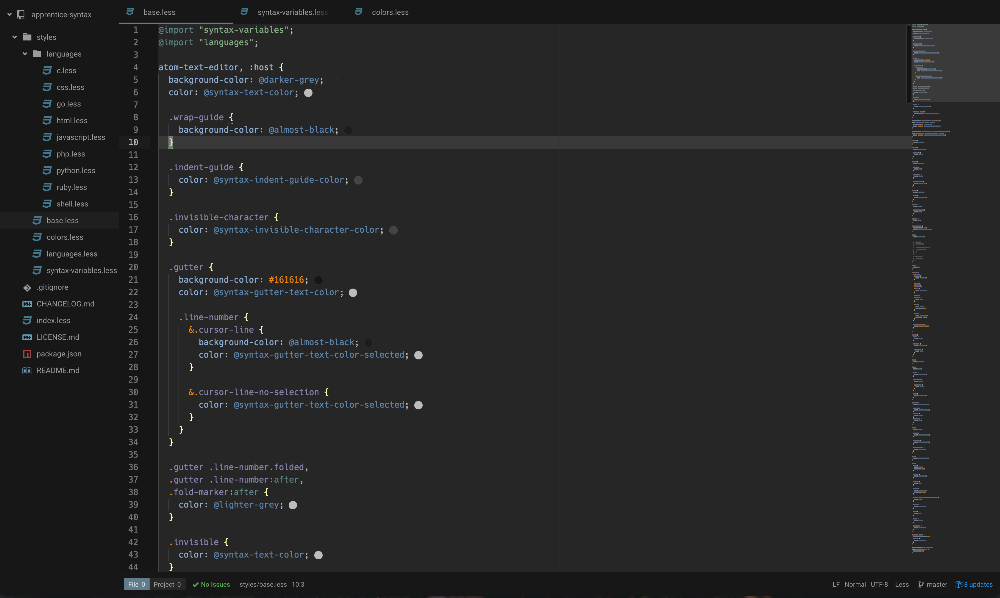

# Apprentice syntax theme for Atom

Port of the Apprentice vim colour scheme [Apprentice](http://romainl.github.io/Apprentice/) to Atom!

If your language is not supported or the syntax colouring seems incorrect, please create a github issue :)

Preview screenshots were taken using the Atom Material UI theme.

### Golang

### Less / Sass

